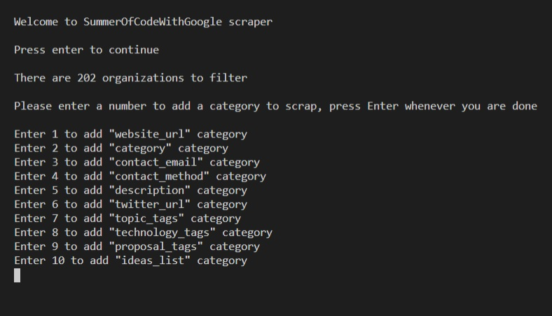

# Ruby-Scraper

## Description

>This is a scraper made with Ruby, to get filtered information from organizations in Google Summer of Code

>The user can select the categories he/she wants to scrap, and filters the information by doing a custom search on all categories, or searching on a selected category. 

## Screenshots



## Live Demo

[Ruby Scraper](https://replit.com/@CarlosOsorio2/ruby-scraper#main.rb)

## Built With

- Ruby

## Installation

1. Run the following command into your terminal: </br> 
```git clone git@github.com:carlos-osorio-developer/ruby-scrapper.git ``` 

2. Make sure you have Ruby installed on your computer

    [Click here for Ubuntu](https://stackify.com/install-ruby-on-ubuntu-everything-you-need-to-get-going/) &nbsp; &nbsp; &nbsp; &nbsp;
    [Click here for Windows](https://stackify.com/install-ruby-on-windows-everything-you-need-to-get-going/)

3. Go to your local project repository with the cd command.

4. Run the following command into your terminal: </br>
```ruby bin/main.rb ```

## How to use

1. Press "Enter" to start the scraper
2. Enter a number to select the categories that you want to scrap from the organizations
3. After you are done selecting the categories, press "Enter" to continue
4. Now enter a keyword for your search, to filter the organizations
5. If you want to choose just one category to search for the keyword, select it from the list, otherwise press "Enter" and you will be looking for the keyword in all the categories
6. The filtered results will be shown to you.
7. Now press "Enter" if you want to do another search, or enter y/Y if you want to quit.

## How to test 

1. Open your terminal
2. To install Rspec, run the following command into your terminal: </br>
``` gem install rspec ```
3. Go to your local project repository with the cd command.
4. To run the test examples, run the following command into your terminal: </br>
``` rspec ```

## Author

👤 **Carlos**

- GitHub: [@carlos-osorio-developer](https://github.com/carlos-osorio-developer) 
- Twitter: [@OsorioDevelops](https://twitter.com/@OsorioDevelops) 
- LinkedIn: [Carlos Osorio](https://www.linkedin.com/in/carlos-osorio-developer/) 

## 🤝 Contributing

Contributions, issues and feature requests are welcome!

Feel free to check the [issues page](https://github.com/carlos-osorio-developer/ruby-scrapper/issues).

## Show your support

Give a ⭐️ if you like this project!

## Acknowledgments

- Project originally taken from The Odin Project
- Project inspired by Microverse Program

## 📝 License

This project is [MIT](./MIT.md) licensed.
